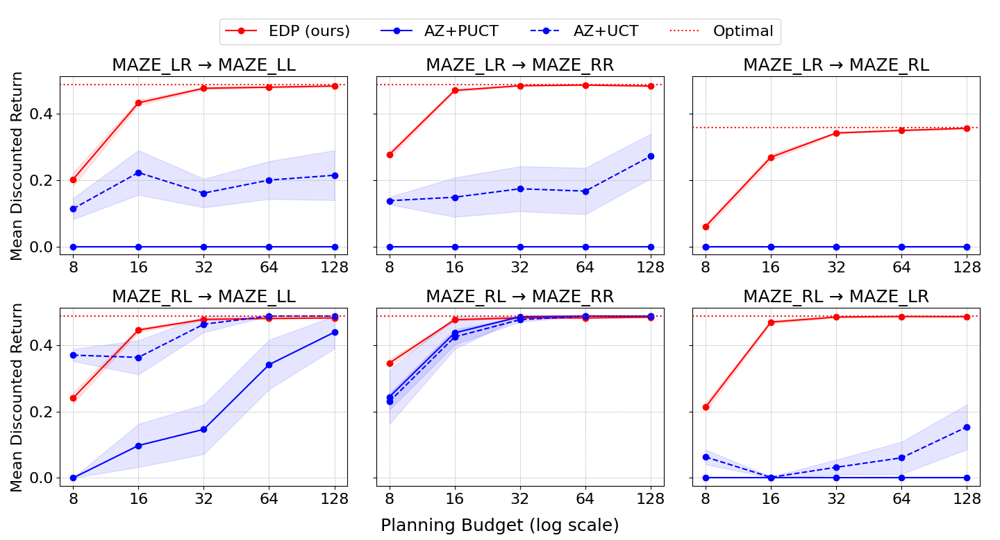

# Improving Robustness of AlphaZero Algorithms to Test-Time Environment Changes 🛡️
Welcome to the official repository of the paper **Improving Robustness of AlphaZero Algorithms to Test-Time Environment Changes**! In this repo, we provide the code and resources to reproduce the experiments and results presented in the paper, as well as experimenting with the implementations of our novel Extra-Deep Planning (EDP) Algorithm and standard AlphaZero (AZ).


<p align="center">
  
    
</p>

## Local Installation
1. Clone the repository:
```bash
git clone https://github.com/TheEmotionalProgrammer/az-generalization.git
cd az-generalization
```
2. Create a virtual environment and activate it:
```bash
python3 -m venv venv
source venv/bin/activate  # On Windows use `venv\Scripts\activate`
```
3. Install the dependencies:
```bash
pip install -r requirements.txt
```

## Repository Structure

The source code folder `src` is organized as follows:

```
src
│── az 
│   ├── nn.py 
│   ├── controller.py
│   └── planning.py
│── edp  
│   └── planning.py
│── mcts_core
│   ├── policies
│   │   └── ...
│   ├── node.py
│   ├── planning.py
│   ├── runner.py
│   └── utils.py
├── environments
│   ├── gridworld
│       └── ...
│   ├── observation_embeddings.py
│   └── register.py
├── experiments
│   ├── evaluation
│   │   └── evaluate_from_config.py
│   │   └── plotting
│   │       └── ...
│   └── training
│   │   └── train_from_config.py
│   └── parameters.py
├── utils
    └── ...

```

where:
- `az` contains the implementation of the standard AZ framework, including training and planning algorithms.
- `edp` contains the implementation of the EDP algorithm.
- `mcts_core` contains the core components of the Monte Carlo Tree Search (MCTS) used in both AZ and EDP.
- `environments` contains the definitions of the custom grid-world environments used for training and evaluation.
- `experiments` contains the scripts for training and evaluating the models.
- `utils` contains plotting and logging utilities.

## Reproducing Results

<p align="center">
  
</p>

The folder `weights` contains the pre-trained weights of the policy-value neural networks used for EDP and AZ evaluation. You can use these weights to reproduce the results presented in the paper, or train your own models from scratch using the provided training script in `src/experiments/training/train_from_config.py`. The evaluation can be run using the provided evaluation script in `src/experiments/evaluation/evaluate_from_config.py`. Both training and evaluation scripts include several parameters that can be adjusted directly in the file. The hyperparameter configurations used in the paper are specified in the related appendix.

## Citation
If you use this code or the results obtained from it in your research, please cite our paper:

```
insert citation template
```
