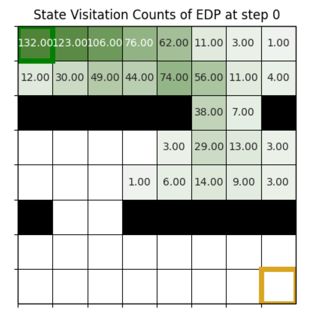
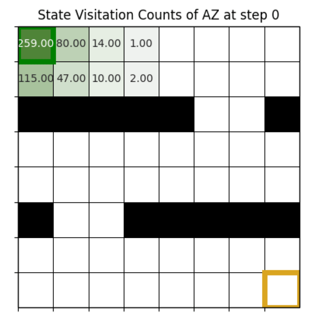

# Making AlphaZero Algorithms Robust to Test-Time Environment Changes 🛡️
Welcome to the official repository of the paper **Making AlphaZero Algorithms Robust to Test-Time Environment Changes**. In this repo, we provide the code and resources to reproduce the experiments and results presented in the paper, as well as experimenting with the implementations of our novel Extra-Deep Planning (EDP) Algorithm and standard AlphaZero (AZ).


<p align="center">
  
    
</p>

## Local Installation
1. Start by cloning the repository:
```bash
git clone https://github.com/TheEmotionalProgrammer/az-generalization.git
cd az-generalization
```
2. Create a virtual environment and activate it:
```bash
python3 -m venv venv
source venv/bin/activate  # On Windows use `venv\Scripts\activate`
```
3. Install the dependencies:
```bash
pip install -r requirements.txt
```


